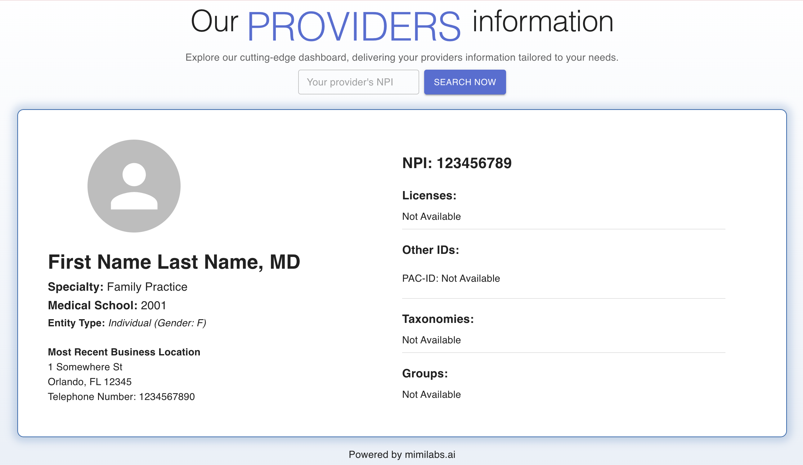

# NPI MEDICAL BOARD


    
     
     
     
      

## Table of Contents

1. Intruduction
2. Tech Stack
3. Features
4. Next Steps
5. Quick Start
6. Footer

## Introduction

A single-page vite+react app using mimilabs NPI explorer API.

Note: Provider's image not available.

## Tech Stack

- React.js
- Vite
- JavaScript
- Material UI
- Styled-components

## Features

- Search for provider by NPI

## Next Steps

- Search for provider by name or NPI
- Search options to choose from before displaying provider information.

## Quick Start

This template provides a minimal setup to get React working in Vite with HMR and some ESLint rules.

**Prerequisites**

Make sure you have the following installed on your machine:

- [Git](https://git-scm.com/)
- [Node.js](https://nodejs.org/en)
- [npm](https://www.npmjs.com/) (Node Package Manager)

**Cloning the Repo**

```
git clone https://github.com/YoshiTunaiga/npi-medical-board.git
cd npi-medical-board
```

**Installation**

```
npm install
```

**Running the Project**

```
npm run dev
```

Currently, two official plugins are available:

- [@vitejs/plugin-react](https://github.com/vitejs/vite-plugin-react/blob/main/packages/plugin-react/README.md) uses [Babel](https://babeljs.io/) for Fast Refresh
- [@vitejs/plugin-react-swc](https://github.com/vitejs/vite-plugin-react-swc) uses [SWC](https://swc.rs/) for Fast Refresh

## Footer & Gratitudes

Powered by [mimilabs.ai](https://mimilabs.ai)
